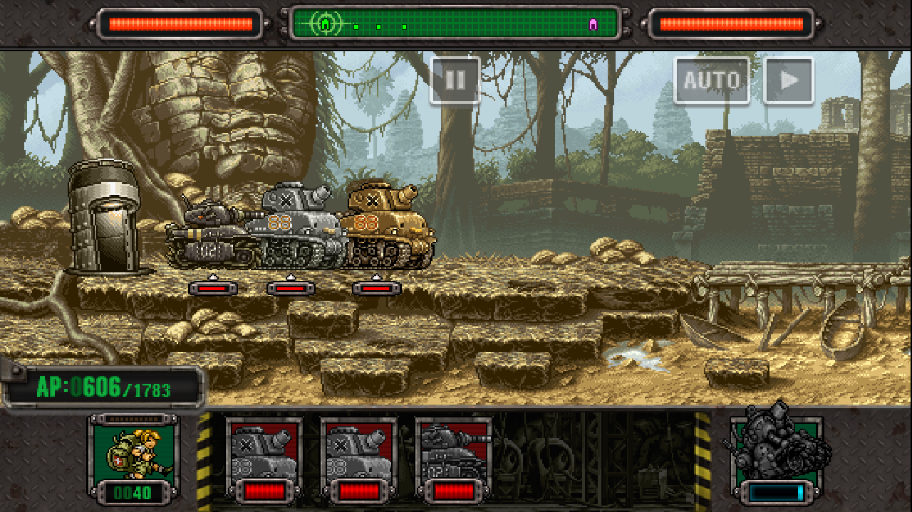
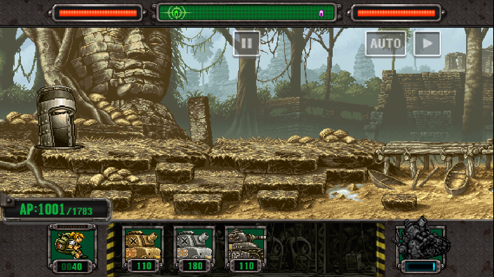

# 原版配色载具：2026.10.04 本地集成记录

三款载具已作为独立社区单位加入本地正式版。图集与图标分别采用黄色、浅灰白和枪灰色配色；参数以对应 MSD 原版载具的同等级状态为参考。原有单位与玩家进度保持兼容。

本次状态为本地实现、构建、部署及受控验证完成。远程提交与发行包尚未更新。独立 beta 工作区继续维护其历史活动功能。

## 参数与购买条件

| 单位 | UnitID | AP | 生命值 | 移速 | 普通／特殊攻击伤害 | 攻击距离 | 生产间隔 | 受击滑行距离 |
| --- | ---: | ---: | ---: | ---: | ---: | ---: | ---: | ---: |
| 基 · 寇卡坦克 MK.II（黄色） | 1027 | 110 | 19/21 倍 | 1.25 倍 | 1.5 倍 | 1.2 倍 | 0.8 倍 | 1 倍 |
| 基 · 寇卡坦克 MK.III（浅灰白） | 1028 | 180 | 2 倍 | 0.8 倍 | 1 倍 | 1 倍 | 1.2 倍 | 1/4 |
| 吉利塔 · O MK.II（枪灰色） | 1029 | 110 | 1.5 倍 | 0.8 倍 | 1.5 倍 | 1.5 倍 | 1.2 倍 | 1/8 |

两个基寇卡以原版 UnitID 3 为参考，吉利塔以原版 UnitID 51 为参考。三个单位均属于叛军。当前基寇卡MKII售价为 **30 勋章**，MKIII与吉利塔O MKII均为 **50 勋章**；原版吉利塔售价为30勋章。

三个新增单位的购买权限共同引用原版吉利塔的商店解锁标记 `MenuShopID 64`。该标记未解锁时，新增单位保持锁定；原版吉利塔获得购买权限后，三个单位同时获得购买权限。单位购买、升级及三组 Deck 保存继续按各自稳定键独立维护。

两款基寇卡保留普通攻击一发、特殊攻击三发。枪灰色吉利塔继承原版攻击动作及发射时序，验证场景中的普通攻击为一发、特殊攻击为三发。生产间隔倍率仅作用于再次出击的等待时间；普通攻击时序和特殊攻击就绪时间继承对应原版状态。

生命值、伤害及距离以精确有理数倍率在原生等级插值完成后缩放，整数结果向下取整。生产间隔采用向上取整，基地强化继续通过原生流程计算。受击滑行倍率作用于载具进入受击状态后的水平运动；攻击属性、受击触发规则及施加给目标的击退参数继承原版。

枪灰色吉利塔的攻击判定距离扩大至 1.5 倍，其弧线弹体水平位移也扩大至 1.5 倍，垂直轨迹保持一致。黄色基寇卡的攻击判定与对应弹体目的距离扩大至 1.2 倍。

## 中文文本

原版普通攻击与特殊攻击说明保留于描述首行。简体中文专属描述如下；繁体中文提供对应字符转换，菜单采用换行排版。

- **基 · 寇卡坦克 MK.II**：为荒漠地形作战设计的基 · 寇卡坦克。 轻量化的装甲使其速度与攻击力更高。
- **基 · 寇卡坦克 MK.III**：为雪原地形作战设计的基 · 寇卡坦克。更慢的速度使其有更强大的装甲。
- **吉利塔 · O MK.II**：为山地地形作战设计的吉利塔 · O。 更慢的移动速度换来了更高的攻击力与装甲。

注册表包含十一种语言。原版简体中文与德语的部分描述为空，相应攻击说明分别从繁体中文转换及英文原文继承。

## 素材与实现

载具使用独立 OBM 文件，保留 MSD 原有图块、锚点、透明度和动画脚本。两款基寇卡分别继承 61 个图块和 16 个动画，吉利塔继承 94 个图块和 37 个动画。三个变体共完成 216 个图块的结构与材质检查，以及 55 个 GIF 预览的解码检查。原版烟雾、爆炸、弹体、尾焰及白色闪光保留原色。

菜单、编队与战斗图标在共享图集中追加，原始区域与既有三个未来单位的图标保持一致。生产冷却期间，战斗栏沿用原生灰化显示；可出击状态显示各自配色。

原版配色以公开精灵参考素材为依据。该流程尚未独立提取并认证 Metal Slug 1 ROM 调色盘。

原生核心新增有理数参数、受击滑行、弧线水平射程及原版商店解锁引用接口。Python 注册层校验接口版本、素材哈希及稳定单位身份。源码入口为 `src/community_content.cpp`、`src/community_content.py` 与 `src/community_blocks.inc`；图集及单位配置位于 `community_content/`。构建脚本支持 `--no-activate`，用于生成验证候选核心并保留当前加载配置。

## 验证与部署

对应机器可读记录为 [CLASSIC_VEHICLES_VALIDATION_2026.10.04.json](CLASSIC_VEHICLES_VALIDATION_2026.10.04.json)。

- 三个新增单位的全部 40 个等级通过生命值、伤害、移速、距离、AP 和生产间隔检查。
- 原版 400 个单位与既有三个未来单位在等级 1、20、40 的状态字节完成 1,209 次比较，与更新前核心一致。
- 两侧阵营分别核验行走及真实受击后的滑行，逐项比较 41 个位置样本；浮点误差容限为 0.003 像素。
- 原生攻击核验实际弹数、发射 tick、伤害和动作持续时间。吉利塔普通与特殊弹体各核验 45 次实际更新的水平及垂直坐标。
- 独立初始存档核验吉利塔解锁条件、49 勋章购买限制、50 勋章原生购买确认、购买后重启及三组 Deck 保存与重启。
- 可见战斗面板核验 AP 扣除、生产冷却、冷却期间重复出击限制及真实单位生成。可出击状态下三个战斗图标通过配色像素检查。
- 三个原生单位名称完成实际文字绘制与宽度核验。繁体中文原生详情界面完成截图与宽度核验；十一种语言完成原生文本返回值及静态字体宽度检查。
- 本地正式运行目录与正式版工作区分别使用其实际宿主、核心、APK 及图集通过隔离启动与解锁检查。

全部自动验证使用独立测试存档。部署前后，既有个人存档与初始种子的校验值保持一致。当前验证覆盖受控场景；全关卡通关、性能及长期稳定性尚待专项验证。

当前核心 SHA-256：`38ebc595ade6cb3c2e78c74cceb502ba34ee1f48ec4586bdc92b6a7f1c34bd9e`。

当前注册表 SHA-256：`46f131dd644af8428bb83d30825c81ba4d2ec54d2c156566824a5f4cc066537a`。

同日参数修订：吉利塔 · O MK.II 的生命值倍率调整为 1.5 倍，AP 调整为 110；基 · 寇卡坦克 MK.III 的 AP 调整为 180，其余注册配置保持一致。未计入基地强化时，吉利塔 MK.II 等级 1、20、40 的生命值分别为 2,100、4,200、6,300。当前等级参数、战斗、实际 AP 扣除及部署启动检查对应修订后的注册表；购买与编队等未变化项目保留此前版本的验证记录，机器可读摘要中的 `verification_revisions` 分别记录其适用版本。

本地运行目录通过 `msd_aot_classic_vehicles_20261004.dll` 加载，正式版仓库通过 `build/MSD_Core.dll` 加载相同核心。正在运行的游戏实例在正常退出并重新启动后加载本次更新。

## 2026-10-06 基寇卡 MKII 售价修订

基寇卡MKII（UnitID1027、MenuShop515）的勋章售价由50调整为30，与原版吉利塔（UnitID51、MenuShop64）的实际勋章售价一致。原生GetMenuShopPrice查询结果均为30；单位原始价格字段为数据行+0x358，经getUnitCreateParams写入输出+0x0c。MKIII、吉利塔O MKII及其余单位售价、战斗参数、购买解锁条件与存档保持现状。本轮证据为verification/white_mummy_animation_20261006/price_check/price_report.json；2026-10-04的50勋章购买验证保留其历史范围。正式版与本地正式运行目录的原生商城查询均通过，普通及原满级入口已同步；部署后记录为verification/white_mummy_animation_20261006/after_installed.json。

## 2026-10-06 基寇卡 MKII 生命、击退门槛与出击冷却（2026-10-06）

- 用户指定基寇卡MKII（UID1027、s1xlv.di_cokka_mk2）Lv40生命值3800、击退门槛随生命倍率同步、出击冷却采用原版基寇卡的80%。冷却按再次出击生产间隔处理。正式版启动HEAD为2011e45，版本保持1.46.4，保留其他任务及LAB项目的既有变化。
- 原生基准：UID3 Lv40 HP4200，六等级锚点击退门槛均10、再次出击冷却均750 tick。现行MKII生命倍率[4,5]→[19,21]，Lv40 HP3360→3800；击退门槛倍率[4,5]→[19,21]，锚点四舍五入后门槛8→9，击退计量800→900。生产参考UID3保持，production_interval_multiplier由[9,10]→[4,5]，基础出击冷却675→600 tick（22.5→20秒），为原版750 tick的80%；基地强化继续通过原生流程处理。
- 保持原值：受击后退距离[1,1]、伤害[3,2]、特殊伤害追加倍率[1,1]、移动速度[5,4]、射程[6,5]、弹道倍率[1,1]、AP110、勋章售价30、购买权限MenuShop64及全部动作脚本。特殊攻击冷却字段与原生行为保持。白木乃伊衔接修复、绿木乃伊与MKII箱体参数、KT-21免费获取机制保持现行配置。
- 实施仅修改注册表UID1027上述三个倍率字段，现行Python加载器与核心已支持，无需重建DLL。正式版实际MSD_Core.dll在独立fixture中核验全部40等级HP、击退计量、getUnitCreateParams返回的生产冷却与AP，通过；AP/RP返还均为11。结构比较确认其余单位及注册字段保持，个人存档未参与测试，未计算SHA-256。
- 本地同步状态：正式版与本地正式运行目录的隔离原生参数检查均通过，普通及原满级入口已同步。
- 同步清单：正式版工作区向dist/MSD_Windows覆盖community_content/registry.json与docs/CLASSIC_VEHICLES_2026.10.04.md，共2个文件；目标配置保持MSD_Core_KT21_r1_20261006.dll。部署后采用目标实际加载器、核心与注册表在独立fixture核查全部40等级参数，installed.json通过。覆盖前副本为dist_before/；普通及原满级入口需正常退出并重启加载更新，全部个人存档及用户进程保持。
- 证据与副本：正式版verification/di_cokka_mk2_balance_20261006内formal.json、verify_balance.py、before/；原始APK审计确认UID3数据行HP锚点1400/2100/2800/3500/4200/4900。未暂存、提交或推送，用户运行进程保持。

等级参数（基础冷却未叠加基地强化；门槛为数据单位，计量包含×100）：

| 等级 | MKII HP | 击退门槛 | 击退计量 | 基础出击冷却tick |
| --- | ---: | ---: | ---: | ---: |
| 1 | 1266 | 9 | 900 | 600 |
| 10 | 1900 | 9 | 900 | 600 |
| 20 | 2533 | 9 | 900 | 600 |
| 30 | 3166 | 9 | 900 | 600 |
| 40 | 3800 | 9 | 900 | 600 |
