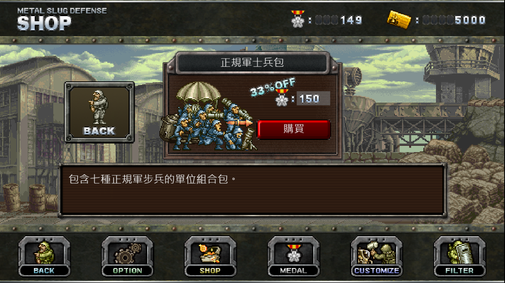

# MSD WINDOWS S1XLV 1.46.3.1

## English

This stable revision integrates the seven Regular Army infantry variants from 1.46.3 beta. The repository is prepared locally; the user performs commit and push through GitHub Desktop. Existing stable content-authoring, campaign, scene, music, and network preparation interfaces are retained.

| Unit | UnitID | AP | Medals |
| --- | ---: | ---: | ---: |
| Regular Army Shield Soldier | 1030 | 35 | 15 |
| Regular Army Rifleman | 1031 | 40 | 15 |
| Regular Army Bazooka Soldier | 1032 | 35 | 15 |
| Regular Army Gatling Soldier | 1033 | 45 | 15 |
| Regular Army Paratrooper | 1034 | 45 | 45 |
| Regular Army Rocket Bomb Soldier | 1035 | 40 | 55 |
| Regular Army Mortar Soldier | 1036 | 50 | 65 |

All seven belong to PF and use the existing Regular Army Soldier uniform palette. HP is `floor(counterpart HP × 10 / 9)` after native level interpolation; AP is the counterpart's AP plus 5. Attack damage, timing, movement, and production intervals retain the counterpart's native values. All seven and their **150-medal pack** are available from the initial profile. Existing profiles purchase new units through the shop. Pack transactions preserve already owned unit levels and prevent repeat charging after all members are owned.

The complete paratrooper chain is `1034 → 1037 → 1032`; the mortar chain is `1036 → 1038`. Internal child units are excluded from shop and deck selection. Actual native text rendering confirms paratrooper/mortar HP of 200/355 in the unowned Lv1 shop and 600/1066 in Lv40 Customize.

The merged native core SHA-256 is `303c315f40451c50b9686a49535459c5eca152d7b0c01ae62936385c4cfbf3c8`. The repository loads `build/MSD_Core.dll`; the local stable runtime loads `build/MSD_Core_Release_1_46_3_1_20261005.dll` with the same hash. Display version, window titles, and EXE file/product versions are 1.46.3.1.

Checks passed for 360 new-unit level comparisons, 1,218 existing-unit comparisons, nine native sprite creations, fourteen attack comparisons, seven movement sequences, both complete creation chains, repeated mortar attacks, and AP deduction. Mouse purchases used the final 15/45/55/65 prices and 150-medal pack, including insufficient medals, partial ownership, duplicate charging prevention, and three-deck save/restart persistence. Initial-profile purchase permissions and 80 display-level comparisons passed. Extension checks covered an independent PNG scene, music, six existing community enemy rosters, and controlled campaign settlement. This scope supports compatibility of the checked interfaces.

The actual stable host completed 215-frame initial/max profile startup, saving, and restart in isolated fixtures. The updated optional Lv1 profile passed checks for 399 original and 13 playable community units, nine native army/base upgrades, 464 initial map records, and persistence across restart. Repository default initial seeds are retained; the local stable runtime receives the matching release seeds. Existing personal progress is retained. Full-stage completion, long-duration stability, and other hardware configurations require separate validation. The local evidence directory is `research/metal_slug_defense/content_work/formal_1_46_3_1_promotion_20261005/`.

## 中文

本次 **1.46.3.1 正式版** 纳入七种新增兵种：**正规军盾牌兵、正规军步枪兵、正规军反坦克兵、正规军加特林机枪兵、正规军伞兵、正规军冲天火箭弹兵、正规军迫击炮兵**。当前完成本地发布准备，提交与推送由用户通过 GitHub Desktop 执行。正式版既有内容制作、扩展关卡、场景、音乐及联机预备接口保持其原有范围。

前四种单位各为 **15 勋章**；伞兵、冲天火箭弹兵及迫击炮兵依次为 **45、55、65 勋章**，均为对应叛军售价加 5。七单位组合包为 **150 勋章**，保留已拥有单位的等级，全部拥有后阻止重复扣费。所有新增单位与组合包在初始状态开放购买，无关卡、军队核、活动或前置单位限制。

全部新增单位归属 PF，服装采用现有正规军士兵配色。AP 为对照单位加 5；生命值在原生等级插值后按精确倍率 10/9 计算并向下取整。攻击、移动及生产参数沿用对应单位。伞兵完整生成链为 1034 → 1037 → 1032，迫击炮生成链为 1036 → 1038，内部子单位排除于商店和编队。实际生命值显示在 Lv1 商店为 200、355，在 Lv40 强化界面为 600、1066。

新增等级参数、既有单位回归、实际攻击与移动、两条生成链、迫击炮连续攻击、生命值显示、AP 扣除、最终售价交易、余额不足拒绝、组合包部分拥有、重复扣费防止及三组编队重启均通过。扩展场景、音乐、六款既有社区敌军名单及受控结算检查通过。两组接口的运行兼容性结论限定上述检查范围。

正式版实际宿主的初始及满级预设完成各 215 帧启动、保存与重启检查。全兵种 Lv1 新建预设包含 399 个原版兵种及 13 种可用社区单位，共 412 个；九项原生强化为 Lv1，464 条地图记录保持初始进度，隔离存档升级与解锁状态在重启后保持。正式版仓库的原始默认种子保留，本地运行目录同步对应发行种子。已有个人存档保留，同步清单排除全部个人存档目录。完整关卡通关、长期运行及其他硬件环境保留后续专项核验范围。
