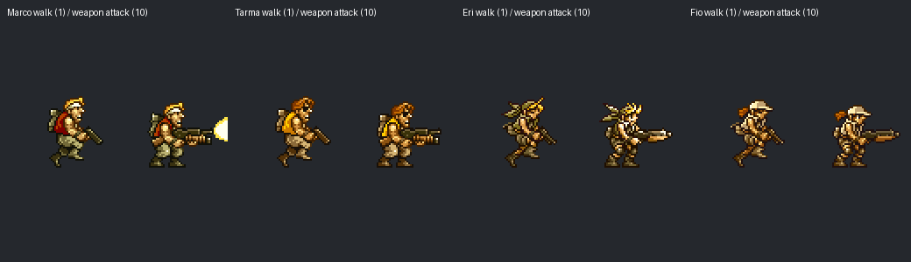

# 1.46.3.1 保留武器参数修订与素材核查

核验日期：2026-10-05。本轮依据玩家反馈修订正式版核心，版本保持 1.46.3.1。十种角色首次特攻后的远程普攻使用各自原生特攻武器的完整弹体参数；首次特攻前的手枪、近战、单位攻击状态及绝招计数继续遵循既有流程。

## 缺陷与实现

原有武器保留钩子已替换攻击动画及弹体动作，九种角色的公共弹体生成入口仍依据普通攻击状态读取手枪参数。该路径同时影响伤害、命中间隔、速度、射程、攻击属性与命中数量。胖英里已通过独立激光钩子引用正确参数，本轮回归通过。

修订在公共 `addBulletImpl` 入口中检查 BattleUnit 身份、十种 UnitID、普通远程攻击状态 40、非零首次特攻计数及默认参数选择标记，然后为本次弹体指定原生特攻参数组 50。源码新增 17 行；单位状态、动作时序、个人存档格式及新增正规军配置保持既有语义。

以下为受控 Lv40 玩家单位的弹体伤害字段。该数值表示单个弹体或单次命中判定参数；实际总伤害还受发射次数、判定间隔、阵营强化及目标抗性影响。

| 单位 | UnitID | 修订前保留攻击 | 当前保留攻击 | 状态 |
| --- | ---: | ---: | ---: | --- |
| 马可 | 16 | 588 | 336 | 本轮修复 |
| 塔玛 | 17 | 588 | 2100 | 本轮修复 |
| 英里 | 18 | 588 | 134 | 本轮修复 |
| 菲欧 | 19 | 588 | 1344 | 本轮修复 |
| 胖马可 | 96 | 672 | 378 | 本轮修复 |
| 胖塔玛 | 97 | 672 | 2940 | 本轮修复 |
| 胖英里 | 98 | 67 | 67 | 既有修订通过 |
| 胖菲欧 | 99 | 630 | 1680 | 本轮修复 |
| 圣诞英里 | 344 | 1176 | 252 | 本轮修复 |
| 圣诞菲欧 | 362 | 1176 | 4200 | 本轮修复 |

## 直接验证

- 240 组武器序列：十种角色、Lv1/Lv20/Lv40、双方阵营的初始普通攻击、手动特攻、保留攻击及重复保留攻击。初始攻击与手动特攻记录在修订前后完全一致，全部保留弹体与原生特攻匹配，普通攻击状态保持 40，特攻计数保持 1。
- 1,239 组单位参数：原版 0–399 及公开社区 1024–1036 在三个等级的 236 字节状态记录与修订前一致。
- 180 组原生命中场景：十种角色、三个等级、双方阵营及三种目标布局，直接调用原生 BattleObjectManager 帧流程；保留攻击的实际单位与基地伤害和各自手动特攻一致。原有武器各自的贯穿、范围、命中次数及间隔得到保留。
- 36 组完整宿主散弹场景：塔玛与胖塔玛、三个等级、双方阵营。排除出生无敌状态后，两名前方目标均受到散弹伤害，后方基地在原生命中范围内同步受击；远距离布局中均无伤害。

原生塔玛、胖塔玛散弹的首次特攻与修订后保留攻击均可同时命中前方单位及后方基地。本次复现支持参数选择错误对玩家所述基地现象的解释；具体战斗仍受出生无敌、空间位置及原生命中矩形影响。高生命值基地 fixture 存在原生浮点整数转换，验证采用对应特攻结果进行比较。

## 普通四主角的特殊武器移动素材

已核查 791 个图块、124 项动作脚本及八张名称相关的补充图集。当前普通形态的步行脚本 1、7 使用手枪或普通姿态；脚本 10 包含持特殊武器攻击。未发现可直接引用的完整持特殊武器前进动画。本轮保持原始图集及移动脚本，素材提取仅用于审计。

| 角色 | 原生主图集 | 图块 | 动作脚本 |
| --- | --- | ---: | ---: |
| 马可 | `marco_out.obm` | 107 | 27 |
| 塔玛 | `tarma_out.obm` | 123 | 26 |
| 英里 | `eri_out.obm`，另有共享效果图集 | 253 | 33 |
| 菲欧 | `fio_out.obm`、`fio_eff.obm`，另有共享效果图集 | 308 | 38 |

## 构建与状态

正式版候选核心为 `MSD_Core_Release_1_46_3_1_Weapons_r4_20261005.dll`，SHA-256：`2574adc112b59355f1f43161ba8060318e073df3b05795f87914929e7c0eff7e`。正式版仓库入口使用 `build/MSD_Core.dll`；本地正式目录及原满级入口使用上述具名核心。同步清单排除所有个人存档，旧核心保留在研究记录及本地运行目录。实际入口启动与存档保护结果见同名 JSON 的补充记录。

验证使用独立存档与受控目标。完整关卡通关、长期稳定性及其他硬件环境保持后续核验范围。原七种正规军兵种的集成依据及扩展接口检查保留 [原验证记录](VALIDATION_1.46.3.1_2026.10.05.md) 的核心与证据范围。GitHub Desktop 提交与上传继续由用户操作，远端状态未核验。
