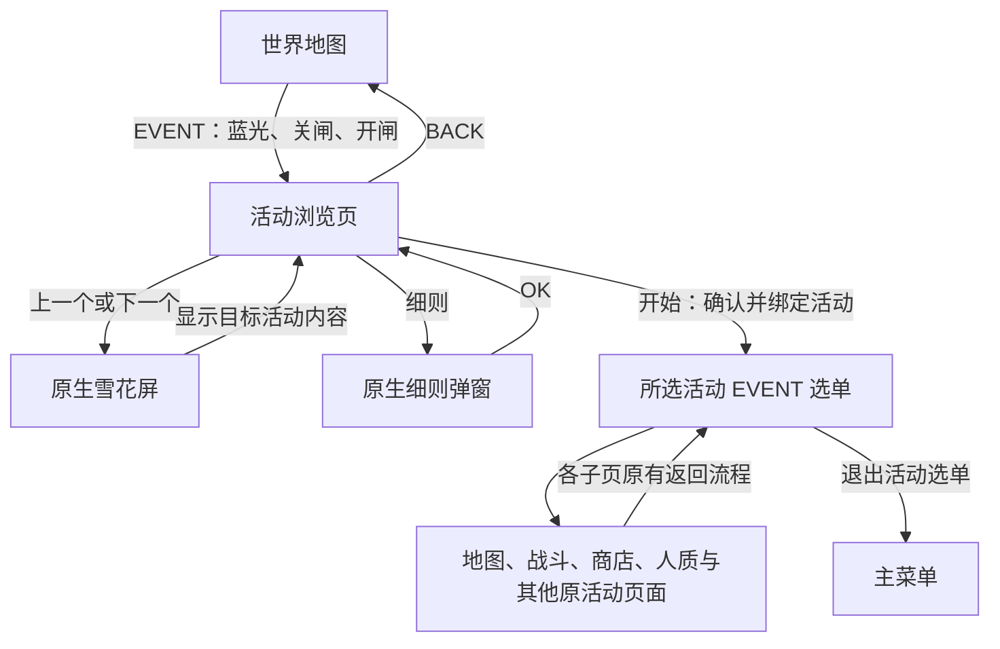

# 历史 EVENT 选择系统重制设计与实施任务书

记录日期：2026-10-08，时区 Asia/Shanghai。本文保留初始设计记录，后续实施及修订见第 13 节。

本文依据初始需求、两张参考图及后续明确答复编写。适用工作区为 `F:\egg\github\metal-slug-defense-on-Windows-ported-edition`。首次文档任务仅新增设计与进度记录；后续实现按各次任务的明确授权开展。当前实施证据见第 13 节。

## 1. 设计目标与确认记录

重制范围包含世界地图 EVENT 入口、历史活动浏览页、细则弹窗、正式活动入口、原价恢复、原活动音乐、人质页面与奖励解锁，以及未来自制 EVENT 的登记接口。

| 编号 | 用户已明确的要求 |
| --- | --- |
| R01 | 玩家通过世界地图中的 EVENT 进入活动浏览页。EVENT 按钮随原生开闸呈现，按下产生原生蓝光反馈，确认后通过原生关闸与开闸进入目标页面。 |
| R02 | 活动浏览页采用主菜单背景、显像管显示区域及原生界面结构。右侧“出击”改为“开始”，“强化”改为“细则”。 |
| R03 | 原“对战”所在行分为等大“上一个”“下一个”按钮。中间露出背景，间隙不属于任一按钮的点击区域。 |
| R04 | 活动按时间顺序循环浏览。最早项向前进入最新项，最新项向后进入最早项；未来自制活动纳入同一序列。 |
| R05 | 按下“开始”前仅处于浏览状态。每次有效翻页均以原生雪花屏过渡，随后显示对应活动当年的图标或宣传内容，保留显像管效果。 |
| R06 | “细则”采用参考图二的原生弹窗形态与动画，显示发行商和发行日期，并保留可关闭窗口的 OK 按钮。 |
| R07 | “开始”进入所选活动的正常 EVENT 选单，保留对应活动的规则、交互、独立代币、商店及进度。 |
| R08 | 活动商店恢复逐商品原版价格，停止统一使用价格 `1`。对应活动没有代币或专属商店时，活动界面不显示 SHOP。 |
| R09 | 所有活动使用其原活动音乐；人质页面须完成卡顿排查，按人质数量解锁单位的流程须正常运行。 |
| R10 | 从已正式进入的 EVENT 选单退出，直接返回主菜单。 |
| R11 | 首次打开浏览页时显示最新活动；后续记住上次浏览项。 |
| R12 | 浏览页底部保留 BACK、OPTION、SHOP、MEDAL、LAB、MISSION 六项。BACK 返回世界地图；其余五项保留现有功能。 |

R11、R12 来自本轮问答；BACK 的目标采用用户随后明确指定的世界地图。主菜单本体与已进入的活动选单具有各自的返回规则。

参考图一为主菜单布局示意。图中创作者宣传图及已有按钮文字不构成 EVENT 素材选择。参考图二提供弹窗外观与 OK 按钮参考，其中许可证内容不纳入活动细则。

- [参考图一：主菜单布局](F:/egg/metal-slug-defense-on-Windows-ported-edition-main/metal-slug-defense-on-Windows-ported-edition-main/screenshots/trmp.png)
- [参考图二：原生弹窗](C:/Users/26839/AppData/Local/Temp/codex-clipboard-5f0a6d19-7b63-4110-aead-bab35ed1f9cf.png)

第二张参考图位于临时目录。后续实现须从原生资源与任务路径定位弹窗；参考图的临时路径不作为运行依赖。

## 2. 本轮只读核查基线

| 项目 | 核查结果 |
| --- | --- |
| 正式版 HEAD | `47245b9`，提交说明 `1.47.2 update` |
| 最近提交 | `47245b9`、`9462163`、`7bdc26d` |
| 工作区启动状态 | `git status --short` 仅显示既有未跟踪 `.claude/`，本轮保留 |
| 显示版本 | 根目录 `branding.json` 为 `1.47.2` |
| 核心配置 | 根目录与 `src/core_runtime.json` 均引用 `MSD_Core_LAB_r24_20261008.dll` |
| 社区注册表 | `community_content/registry.json` 为 schema 2 |
| 活动目录 | 10 项活动、176 条关卡记录 |
| 已登记活动商店 | 秘宝 21 项、圣诞 36 项、合作 44 项，合计 101 项 |
| 核查方法 | 文本、JSON 结构与代码路径读取；未执行游戏、构建、哈希计算或个人存档读写 |

现行选择器使用原生 Mission 滚动列表。点击活动行后立即调用 `EventTrial.select(..., True)`，随后进入活动基地。该路径属于拟替换范围。

`select()` 会保存基准代币、创建活动进度、替换 Mission/Survival 表并写入原生 SurvivalPoint。浏览、翻页及细则操作须使用独立的预览状态。活动运行上下文仅在“开始”确认后绑定。

现行数据存在历史状态标签：`catalog.json` 记录已部署选择器，部分 `data/*.json` 仍含 `research_data_only`、`pending`。后续交接须依据实际加载链与对应运行报告判断状态，保留标签差异的来源记录。

## 3. 页面流程与状态边界

| 状态 | 可保存内容 | 可执行操作与结束条件 |
| --- | --- | --- |
| 世界地图 | 原有世界地图状态 | EVENT 随开闸显示；稳态受理有效点击 |
| 进入浏览页的闸门过渡 | 待进入页标记 | 关闸完成后初始化浏览内容，随后开闸；避免过渡期间重复请求 |
| 活动浏览稳态 | `preview_event_key` 与单独的浏览偏好 | 上下翻页、细则、开始及六项底栏操作 |
| 显像管过渡 | 目标活动键与原生动画状态 | 雪花完成后提交目标显示；过渡期间避免接受重复翻页或开始 |
| 细则弹窗 | 弹窗所属预览活动键 | 阻止背景交互；OK 完成关闭动画后恢复浏览稳态 |
| 开始过渡 | 待激活活动键 | 单次激活、完成资源绑定及原生场景初始化，然后开闸 |
| 活动选单及子页 | `active_event_key` 与该活动的独立进度 | 按对应原活动规则进行交互、结算、奖励与保存 |
| 退出活动 | 已完成的合法进度 | 恢复借用的数据表和货币上下文，清理运行覆盖，再进入主菜单 |

上述字段与状态名称为设计用语，后续实现可沿用现有命名约定。`preview_event_key` 与 `active_event_key` 须具有清晰边界。

### 3.1 浏览期的副作用限制

翻页与查看细则仅访问活动元数据及预览资源。浏览期不得绑定关卡表、切换原生活动代币、创建该活动的游戏进度、发放奖励、扣除体力或设置战斗继续标记。

用户要求记住浏览项，因此允许保存单独的 UI 偏好。该偏好使用稳定 `event_key`，与 `historical_event_progress.json` 的游戏进度分开处理。缺失或失效的记忆项回退到当前最新有效活动；目录更新后保留仍有效的记忆项。

### 3.2 底栏及返回规则

浏览页 BACK 返回世界地图，保留进入浏览前的合法世界、区域与滚动状态。Esc 在无弹窗的浏览稳态下采用相同返回目标；细则打开时先关闭细则。

浏览页 OPTION、SHOP、MEDAL、LAB、MISSION 保留当前功能。浏览页 SHOP 使用主菜单的全局商店和正常货币价格。活动专属商店在“开始”激活活动后依据活动能力出现。LAB 继续沿用现有 LAB 的进入与退出规则，MISSION 继续打开原有任务功能。

底栏子页的返回路径依其现行功能逐项核查。若原路径回到浏览页，应恢复预览项与 UI；若原功能规定回到主菜单，应结束浏览上下文并保留浏览偏好。任一底栏操作均不得自动激活预览活动。

活动内部的地图、商店、人质等子页保持各自层级返回。玩家退出活动顶层选单后直接回主菜单，完整恢复非活动上下文。两条顶层返回路径分别验收，防止浏览页 BACK 与活动退出共用错误目标。

已只读核对原生 `SceneFunc` 跳表与生成源码：主菜单初始化/循环为场景 27/28，世界地图初始化/第二阶段初始化/循环为 31/32/34。现行 `leave()` 经清理后进入 31，可作为浏览页 BACK 的候选；活动顶层退出需经清理后进入主菜单初始化路径 27。返回目标仍须经过原生清理与初始化流程。

## 4. 界面与原生交互要求

### 4.1 世界地图 EVENT 按钮

按钮的创建、绘制顺序、开闸呈现、受理时机、按压状态与命中矩形须与同页原生按钮一致。按钮应在开闸揭示的首帧已位于正确层级，避免开闸结束后才追加图像。

按下、拖动、释放沿用原生规则：有效按下显示蓝光；拖出、取消或异常释放须清理按压状态；确认操作只触发一次。确认后沿用原生闸门关闭、关闭完成判定、目标页初始化及闸门打开顺序。动画与确认音效以原生任务实测为基准，避免以固定帧等待替代正常完成判定。

### 4.2 主菜单式活动浏览布局

保留主菜单背景、顶部栏、显像管外框、原生 CRT 层与底部六项按钮。右侧上两行保持原有大按钮边界与文字区域，分别显示“开始”“细则”。第三行设置左侧“上一个”、右侧“下一个”。

设第三行可用总宽为 `W`，按钮间隙为 `G`，每个按钮宽为 `(W-G)/2`；两按钮高度一致，各自具有完整原生边框。`G > 0`，间隙直接显示背景，且不接受按压或释放。最终尺寸从原生逻辑坐标与参考布局核定，窗口和全屏共用同一变换。

按钮文本随游戏语言提供对应翻译。中文语义按本轮要求保持；原生字体、边框、文字对齐及按压反馈须一致。浏览模式中原“对战”业务不得继续响应第三行的旧命中范围。

### 4.3 循环顺序与显像管内容

活动使用经核实的首次上线日期排序，合并活动的扩展日期另行登记。日期相同时采用稳定的次序字段；日期未核实的自制活动由明确登记次序参与排序，避免根据客户端版本字符串推测日期。

有效活动数量为 `N > 0`、当前索引为 `i` 时，前一项为 `(i-1+N) % N`，后一项为 `(i+1) % N`。单项目录的有效翻页仍呈现一次雪花屏并回到同项。空目录须呈现可返回的说明，并禁用开始与翻页；该状态为扩展目录异常处理范围。

每次有效翻页执行一次原生雪花屏，然后显示目标活动当年的新闻图、活动图标或宣传内容。CRT 扫描线、遮罩、显示位置、显像管入场与内容裁切沿用原版。活动切换仅影响屏幕内容及对应元数据；界面框架保持稳定。

主菜单当前支持用户自定义宣传图。活动浏览内容须独立绑定所选 EVENT 的原始素材，普通主菜单继续使用现有设置。原始像素、透明度、框架及锚点应保留，像素素材缩放采用最近邻。

现行图像覆盖在首次访问时加载并固定于会话内，且生成代码存在固定 monitor/news 任务的补丁。因此，逐活动切换须处理该覆盖与纹理缓存的作用域，并复用原生雪花与 CRT 任务。仅修改 PNG 路径不足以满足动态切换要求。

### 4.4 细则弹窗

采用参考图二的半透明深色窗口、原生边框、文字布局、入场和退场动画。背景继续显示当前预览活动，弹窗期间阻止背景按钮操作。OK 按钮保留原生按下反馈、确认音与关闭行为；关闭后保留当前活动。

最少显示活动名称、发行商、发行日期。日期按证据标明平台；合并扩展另列扩展日期。发行日期只由公告确证的上线信息填入。客户端数据版本与活动首发日期分别保存；仅能核实公告日期时，明确显示证据状态。

图二可定位到原生 `SetContentsWindow_OpenSourceLicenses`；优先研究其通用 `CreateContentsWindow`、`OpenContentsWindow`、`CloseContentsWindow` 生命周期并填入活动信息。现有 `SetPopupOK` 为备选入口，其框体与动画的匹配程度需要验证。本文未将许可证内容写入活动细则。

## 5. 活动元数据与官方日期依据

现行目录缺少发行商、发行日期、排序、CRT 宣传素材及各页面音乐字段。后续补充这些字段时须保留原 `event_key`。

下表给出本轮核实的历史活动日期。官方资料所载这些活动的历史发行主体为 **SNK PLAYMORE CORPORATION**。公司名称变更为 SNK CORPORATION 的生效日期为 2016-12-01；发行商登记以活动当时主体为依据。[SNK 官方名称变更公告](https://www.snk-corp.co.jp/us/press/2016/110101/)

| 活动键 | 首次上线与扩展信息 | 日期证据与限制 |
| --- | --- | --- |
| `anniversary_2015` | 2015-04-30 | Android 明确；iPhone 确切日期待核验。[周年公告](https://game.snk-corp.co.jp/press/pdf/150430_02.pdf) |
| `msd_max_2015` | 2015-07-23 | Android 明确；iPhone 确切日期待核验。公告中的直升机捕虏奖励支持本地活动归属。[更新公告](https://game.snk-corp.co.jp/press/pdf/150723_01.pdf) |
| `midsummer_horror_2015` | 2015-08-20 | Android 明确；iPhone 确切日期待核验。[恐怖夜公告](https://game.snk-corp.co.jp/press/pdf/150820_01.pdf) |
| `sleeping_gigantic_weapon_2015` | 2015-09-03 | Android 明确；iPhone 确切日期待核验。[巨大兵器公告](https://game.snk-corp.co.jp/press/pdf/150903_02.pdf) |
| `battle_cats_2015` | 2015-10-06；扩展公告 2015-10-20 | 首期活动期间为 10-06 至 11-04；10-20 公告确认追加内容。合作方 PONOS 单独登记。[首期](https://game.snk-corp.co.jp/press/pdf/151006_02.pdf)、[扩展](https://game.snk-corp.co.jp/press/pdf/151020_02.pdf) |
| `halloween_2015` | 2015-11-05 | Android 明确；iOS 确切日期待核验。[万圣节公告](https://game.snk-corp.co.jp/press/pdf/151105_01.pdf) |
| `treasure_recovery_2015` | 2015-11-19；阿玛迪斯扩展 2015-12-03 | 两次公告均明确 Android/iOS 日期。[首期](https://game.snk-corp.co.jp/press/pdf/151119_01.pdf)、[扩展](https://game.snk-corp.co.jp/press/pdf/151203_01.pdf) |
| `melty_christmas_2015` | 2015-12-17 | Android/iOS 明确。[圣诞公告](https://game.snk-corp.co.jp/press/pdf/151217_01.pdf) |
| `kof_black_noah_2016` | 2016-01-14 | Android/iOS 明确。[黑色诺亚公告](https://www.snk-corp.co.jp/us/wp/wp-content/uploads/2016/06/160114_1.pdf) |
| `cooperation_2016_current` | 合作首发 2016-01-28；Rootmars 扩展 2016-03-10 | 日期对应官方合作功能。`current_mod_1.46.0` 的改版作者、快照发布日期与完整内容对应关系仍待核验。[合作首发](https://www.snk-corp.co.jp/us/wp/wp-content/uploads/2016/06/160128_1.pdf)、[扩展](https://game.snk-corp.co.jp/press/pdf/160310_02.pdf) |

细则显示可采用“发行日期：2015-04-30（Android）”。iOS 日期尚未确证时保留待核验状态。游戏本体发行日期 `2014-05-01` 不应用作这些活动的发行日期。

## 6. 正式活动规则、商店与保存

### 6.1 逐活动原版规则

“开始”确认后进入对应活动的原生 EVENT 基地及选单，保留 NPC、地图、小关、补给、Deck、任务、活动道具和奖励条件。活动进入本身不扣除体力；战斗开始按所选关卡原始成本处理。

现有控制器类型包括 rescue、parts、collaboration_rescue、clear_reward、legacy_survival、invitation、current_cooperation。各类型分别对照来源版本，核查条件、战斗结果、开放规则、奖励与返回流程。当前合作内容保留离线单人适配的证据范围；原在线服务恢复须另行立项。

现行目录的七项无商品行活动仅表明当前未登记专属商店。其数据仍注明原全局商店表已恢复、活动可用性待适配，逐活动历史核查须确认原商店与奖励的实际定位。

### 6.2 商店显示与原价恢复

活动专属 SHOP 的出现条件为：当前已激活 EVENT，且已核实并成功绑定该活动的代币、专属商店目录及原购买条件。无代币或无专属商店的活动隐藏基地面板与地图底栏 SHOP，同时停用输入和直接打开请求。切换或退出活动须清理前一活动的商品、余额映射与交易状态。

| 当前商店 | 独立代币 | 商品数 | 已保存的原价范围 |
| --- | --- | ---: | ---: |
| 秘宝夺还 | `treasure_coins` | 21 | 10,000–2,500,000 |
| 战场圣诞 | `christmas_points` | 36 | 500–1,000,000 |
| 合作活动 | `cooperation_points` | 44 | 10–10,000 |

101 条商品均已保存正整数 `event_currency_price`。后续以逐商品已核实价格统一驱动卡片显示、确认弹窗、余额检查、实际扣款与事务校验。`event_currency_price_raw` 为源表原始字段，其具体含义仍需对照原生计价函数，与实际价格来源分别处理。例如圣诞雪女英里原始字段为 100000，已提取的实际兑换价为 500。

限购、库存、单位已拥有、阶段开放、数量及原生折扣规则须逐项保持。已有六条受原生条件限制的商品继续开展专项核查：圣诞 ID 317；合作 ID 317、334、335、336、337。

普通主菜单全局商店须保持原有价格与货币规则。原价恢复作用于后续合法兑换；已有单位、兑换次数、库存与代币余额须保留，避免因取消价格 1 而重置个人进度。

### 6.3 身份与事务

活动进度继续使用稳定 `event_key`；关卡身份使用活动键与关卡稳定键组合。现行商品保存实际使用活动内原生商品 ID，后续接口若引入稳定商品键，应提供明确映射及无损迁移。

各活动分别保存代币、关卡、人质、零件、奖励领取与商店次数。玩家单位所有权、MSP、勋章仍按现行共享规则处理，独立启动存档继续各自隔离。

保留 `test.dat` 与 `historical_event_progress.json` 的事务备份、兑换检查及恢复流程。自制 EVENT 涉及额外社区进度文件时，将相应文件纳入同一事务。浏览偏好不得参与商品发放事务。

## 7. 原活动音乐

每项活动建立页面级音乐清单，覆盖浏览预览、活动基地、世界与区域、小关选择、商店、人质、战斗、胜利与失败。逐关 BGM 已存在于 `native_maps.json`；其他页面映射仍需原版本核查。

活动浏览页复用主菜单外观时，所选活动的音乐来源须独立核定。翻页后使用对应活动经核实的页面音乐；弹窗沿用父页面音乐，来源有专门切换时按原行为处理。确证缺失的映射保留待核验状态，进入实现前补齐。

按来源保留共享曲目的合法复用；清理前一活动的循环播放与待播请求，避免跨活动叠播。音乐和音效开关继续生效，原生菜单确认音、雪花与闸门音效按其任务路径保留。胜利、失败、战斗及选单音乐须分别取证。

## 8. 人质页面、性能与单位解锁

### 8.1 原规则核查

逐活动核实人质或零件的计数单位、分母、区域条件、数量门槛、阶段奖励、目标单位及领取方式。保持原版自动发放或确认领取的行为，并保留已有单位等级与幂等领取记录。

当前宿主按区域计数达到上限发放部分奖励；parts 模式另有集齐条件。猫咪活动的原始奖励数据包含额外字段，邀请、通关与任务奖励也需分别对照。通用区域满额判断的适用范围须得到来源与运行证据支持。

战斗结算、人质计数、页面显示、奖励触发与重启后的拥有状态须一致。重复通关按原规则累计且限制合法上限；不得因翻页、打开人质页或重复点击发放额外单位。门槛前一项、恰好达到门槛、超过门槛、已拥有单位及再次进入均须验证。

### 8.2 卡顿诊断与验收范围

本轮未运行人质页面，用户所述卡顿的触发条件与成因仍待复现。实施前使用独立 fixture，记录活动键、世界与区域、语言、捕虏进度、实际入口、核心版本和逐帧时间。

分别测量冷启动首次打开、缓存后反复打开、滚动或切换、奖励演出、语言切换及关闭返回。记录逻辑、资源读取、纹理上传、文本生成、音频、存档与绘制成本，定位阻塞发生的具体阶段。

验收以 30 FPS 的约 33.33 ms 帧预算为参考，报告中给出中位数、P95、最大帧耗时、超过预算的帧数及原因。与同设备原生页面对照，并检查重复初始化、每帧资源加载、重复奖励检查与场景往返。完成范围应覆盖真实窗口呈现；离屏数据作为补充证据。

活动人质页应完整显示原文、头像、进度及奖励，输入和动画能够持续推进，关闭后恢复正确页面与音乐。对已复现的异常，应给出同条件修复前后记录。性能结论限定实际硬件、分辨率、存档规模与测试时长。

## 9. 自制 EVENT 接口设计

扩展使用独立目录与登记清单，进入同一浏览页和循环序列。官方内容及既有进度保持稳定键。下列字段为拟议接口要求，本轮未改动 JSON schema 或加载器。

| 字段组 | 最少内容 |
| --- | --- |
| 身份与来源 | schema 版本、唯一 `event_key`、内容类型、作者或发行者、来源版本与引用 |
| 浏览元数据 | 本地化名称、发行日期及平台、日期证据状态、稳定排序次序、CRT 素材与帧标识 |
| 活动能力 | controller、地图、代币、专属商店、人质、零件、邀请与任务奖励的显式声明 |
| 数据与资源 | 关卡、区域、小关、商品、奖励、语言与音频的相对路径及映射 |
| 保存兼容 | 关卡与商品稳定键、运行 ID 映射、存档 schema、旧键迁移规则 |

日期与发行者由自制包声明，官方来源与包作者分别显示。排序应允许新活动加入，循环边界由有效目录即时计算。包缺失或登记无效时，不影响其他合法活动及已保存进度。

现行加载器对 `data_path` 仅取文件名并固定从 `historical_events/data/` 加载；扩展实现需支持包内相对路径并核查解析结果位于包目录。重复活动键、关卡键、商品键及资源命名冲突须给出明确诊断。

当前原生适配限制包含：每区域 1–5 个小关标记、每世界至多 16 个区域、人质文本按 11 种语言提供。接口应公开这些限制，并对超限声明作出可诊断的处理。原生关卡和商品 ID 跨活动复用时，保存身份仍须按活动隔离。

## 10. 拟修改范围与只读代码依据

下表给出后续实施的定位依据。路径位于正式版工作区；行号为本轮快照。此表不构成本轮代码修改清单。

| 位置 | 现行行为 | 后续用途 |
| --- | --- | --- |
| `event_native_selector.py:14`、`:46`；`src` 镜像 | Mission 初始化与选择后立即进入活动 | 替换为主菜单式浏览，并分离预览与激活 |
| `event_trial.py:27`、`:83`、`:349`、`:458`、`:527` | 价格 1 的表写入、兑换、检查及旧绘制 | 使用逐商品原价，覆盖全部读取点 |
| `event_trial.py:101`、`:168` | 原生闸门关闭、完成判定、打开 | 在正确场景生命周期中复用 |
| `event_trial.py:106`、`:265` | 活动绑定与上下文恢复 | 限定开始后激活及退出清理 |
| `event_trial.py:205`、`:343` | 交易备份、发放与扣费校验 | 保留并按扩展文件范围完善 |
| `event_trial.py:284` | 区域满额与零件奖励处理 | 对照各原活动规则与门槛 |
| `event_trial.py:315` | 原生 `SetPopupOK` 现有调用 | 细则弹窗的候选入口，须核对参考图动画及布局 |
| `src/generated/blocks_043.cpp:7957`、`:6352`、`:8418`、`:8740` | 许可证内容窗口及通用创建、打开、关闭路径 | 优先复用参考图二窗口的框体与生命周期 |
| `event_trial.py:425` | 世界地图 EVENT 的宿主命中处理 | 接入原生按压与可见性时序 |
| `src/generated/blocks_042.cpp:2007`、`:3921` | 原生 `GT_CockpitButton` 更新与绘制 | 按钮状态、蓝光及命中时序候选 |
| `src/event_trial_hooks.cpp:37`、`:48`、`:138`、`:197`、`:239` | 主菜单重置、价格、BGM、人质页及无商店限制 | 审核覆盖作用域及模式切换 |
| `event_native_map.py:16`、`:32`、`:38`、`:82`、`:98` | 地图容量、文本、战斗音乐与捕虏保存 | 原规则对照、自制包约束与人质验证 |
| `src/custom_menu.py:14`、`:31` | 会话内固定菜单图集 | 建立活动预览图集作用域 |
| `src/generated/blocks_042.cpp:6278` | 固定 monitor/news 任务的既有补丁 | 逐次触发翻页的原生雪花，并切换活动内容 |
| `src/generated/blocks_042.cpp:1719`、`:6264`、`:8263` | `GT_MenuMonitorIn`、`GT_MenuMonitorCG`、`GT_MenuMonitorSand` | 原生显像管入场、内容及雪花任务候选 |
| `src/generated/blocks_010.cpp:4189`、`:4201`、`:4213`、`:4219`、`:4237` | 主菜单 27/28 与世界地图 31/32/34 的原生分派 | 核实两类返回目标及生命周期 |
| `event_trial_launcher.py` 与 `src` 镜像 | 实际宿主、返回分派与活动资源路径 | 核实实际导入链、资源与输入上下文 |
| `historical_events/catalog.json`、`native_maps.json`、`data/*.json` | 目录、逐关音乐与原价、奖励来源 | 补齐元数据、能力及来源证据 |

普通主菜单、世界地图、VERSUS、LAB、全局商店及独立存档入口均属于相关回归范围。后续代码修改按实际加载链同步根目录和 `src` 镜像。

## 11. 实施阶段与验收矩阵

1. 建立逐活动来源清单：CRT 素材、发行元数据、各页音乐、商店、代币、人质与奖励规则。
2. 在独立存档下复现现行入口反馈和人质异常，记录可重现基线。
3. 实现浏览状态、原生按钮与闸门、循环翻页、雪花与细则；验证浏览期副作用边界。
4. 接入开始与两类返回路径，保留五项底栏功能并检查主菜单初始化钩子。
5. 恢复逐商品原价及页面音乐，完成人质页面与奖励规则适配。
6. 接入自制目录与兼容规则，再完成当前活动及相关功能回归。
7. 功能完成并通过对应验证后，按项目授权时机与明确文件清单维护两个固定运行目录；Git 提交、推送与发布由用户执行。

| 验收编号 | 场景 | 通过条件 |
| --- | --- | --- |
| A01 | 世界地图开闸与 EVENT 入场 | 按钮在揭示首帧已就位，按下蓝光可见，关闸与开闸顺序正确，无重复业务或其他按钮误反馈 |
| A02 | 初次与再次浏览 | 初次为最新项；后续按稳定键恢复上次项；失效项回退可用最新项 |
| A03 | 双按钮布局 | 等大、边框完整、间隙露背景；间隙、拖出及取消不触发翻页 |
| A04 | 全目录循环 | 所有相邻项、最早向前及最新向后均正确，新增自制项纳入循环 |
| A05 | 每次翻页 | 每次有效操作均呈现原生雪花，随后显示对应活动素材；无前一活动纹理残留 |
| A06 | 浏览与细则副作用 | 活动余额、进度、奖励、借用表与战斗继续标记保持；仅独立 UI 偏好可变化 |
| A07 | 细则 | 发行主体、日期与平台对应来源；窗口、动画及 OK 正常；背景操作被阻止 |
| A08 | 六项底栏 | BACK 回世界地图；其余五项原功能有效；全局 SHOP 正常；任何操作不激活预览活动 |
| A09 | 开始与活动退出 | 单次激活正确活动，内部返回层级有效；退出顶层直接主菜单，数据覆盖与货币恢复 |
| A10 | 101 项商品原价 | 显示、确认、余额拒绝、扣款与事务检查一致，限购和原生条件保留 |
| A11 | 无商店活动 | 活动 SHOP 绘制、命中及直接调用同时停用，无全局商店或前一活动商品泄漏 |
| A12 | 交易与兼容 | 取消、重复确认、故障回滚、重启恢复与既有拥有状态正确，不重置历史进度 |
| A13 | 全页面音乐 | 来源清单逐项核对，切换无叠播，胜负音乐正确，静音及音效设置持续有效 |
| A14 | 人质页面 | 首次、反复进入、滚动、语言、演出及返回正常；异常复现项有修复前后证据 |
| A15 | 单位解锁 | 门槛前、门槛处、超过门槛、重复领取、已有等级与重启状态符合各原活动规则 |
| A16 | 活动隔离 | 秘宝、圣诞、合作的共享原生 ID 及独立代币、商品保持隔离；周年、MSD MAX、盛夏恐怖、巨大兵器、猫咪交叉切换后，人质、零件和奖励记录保持隔离；有商店与无商店切换无残留 |
| A17 | 扩展接口 | 合法新包可浏览、查看细则、开始及保存；重复键、失效路径、缺失资源与超限可诊断 |
| A18 | 相关回归 | 主菜单、世界地图、OPTION、SHOP、MEDAL、MISSION、VERSUS、LAB 与独立入口仍按现行规则运行 |

覆盖所有活动的入口、规则与数据检查；战斗至少覆盖各活动的首关、中间关、末关及各控制器的代表流程。完整通关、长期运行与跨设备表现须另有对应证据。

验证使用初始、部分进度、奖励门槛及已拥有单位等独立 fixture。禁止写入个人 `play_save*`、`lab_test_save`、`lab_presets` 及用户配置。当前停用 SHA-256 规则继续适用，复用旧脚本前须审查哈希分支和写入路径。

## 12. 证据限定与待核验事项

- 十项目录与现有控制器表示本次恢复配置范围。猫咪联动本地 31 条关卡与官方公告 32 关的差异仍需核实。
- 旧 `AGENTS.md` 第 7 节记录八条小关缺原始浏览标记；现行 `native_maps.json` 的 176 个标记均声明 `source_native_stage_marker`，且 `fallbacks=[]`。后续对照研究目录 `corrected_stage_audit.json` 及提取源核查差异，保留旧记录的时间范围。
- 旧报告已记录部分奖励文本、重启、商品发放与关卡音乐验证；其核心和价格基线具有历史适用范围，重制后须重新验收。
- 原按钮蓝光、雪花及弹窗任务为可复用候选。最终挂接点、动画时序、素材帧与场景清理顺序需要后续隔离运行核实。
- 官方历史活动日期已按第 5 节核查。部分 iOS 首发日期、当前改版快照来源、自制包格式细节及部分奖励条件仍待补齐。
- 初始文档任务完成需求、代码现状、实施范围与验收标准的整理；该次任务结束时各项功能尚未实施。后续状态见第 13 节。

历史研究证据目录：`F:\egg\research\metal_slug_defense\content_work\historical_events_audit_20261003`。其中 `EVENT_ATTRIBUTION.md`、`HISTORICAL_APK_REPORT.md`、`beta_event_rules_revision/verification_summary.json` 与 `text_and_persistence_verification.json` 保留原始核查条件。另参阅 `F:\egg\AGENTS.md` 与正式版 `docs/VALIDATION_1.46.2_2026.10.04.md`。

## 13. 后续分期规则与故障修复

r25 已实施主菜单式浏览、原生 EventMSD、原价与相关返回流程，记录于 `F:\egg\AGENTS.md` 第 80.4 节。本轮接续 Claude 因额度中断的故障修复，最终修订为 r29，已完成两个固定运行目录同步（猫咪缩放与分页专项为 r28）；修订及验证入口见 [EVENT 修复交接](F:/egg/github/metal-slug-defense-on-Windows-ported-edition/docs/events/EVENT_REPAIR_2026.10.08.md)。

用户最新要求覆盖初始合并活动设计：猫咪、秘宝／阿玛迪斯与合作分别设置 P1/P2 浏览入口。P1 仅显示原首期内容，P2 包含可继承的首期与后期内容；合作 P2 保留全部当前后续扩展。原活动键继续管理共享进度，独立入口键管理浏览、图片与偏好。当前为 10 个活动家族、13 个浏览入口。

本轮修订包含活动商店返回女教官、LAB 绘制场景限制、第五区域与 BASE 的来源布局、完整原生雪花脚本、关闸期间原图保持，以及按可见分期计算任务进度。猫咪地图另行恢复区域放大、原生分页及图像与命中共用的几何，并追加商店往返黑图回归检查。来源与实际验证条件详见交接文档。

## 14. r25 实施快照（2026-10-08）

- 活动世界改走原生 EventMSD（经典活动模式 3 并保留原生世界号，猫咪模式 4，秘宝/圣诞模式 5，合作原生模式 6）；巨灵战车零件页由原生 `CreatePrisonerTask` 在世界 3 绘制零件，无效奖励 ID 不再循环弹窗。
- 浏览页已实现（`event_browser.py`）：原生主菜单、显像管原图与原生雪花、開始/細則/上一個/下一個（等大两段，间隙不受理）、細則弹窗（原生 SetPopupOK）、首次最新与记忆上次、BACK 回世界地图、基地退出回主菜单。
- 商店改用逐商品原价；Survival 活动的兑换商店为原生 BASE 区域商店，读取该活动目录。
- 未完成：细则窗口未改用许可证 ContentsWindow；非繁中语言实机显示、真实对战评级与人质奖励、合作联机/NPC 服务、历史区域名称原文。
